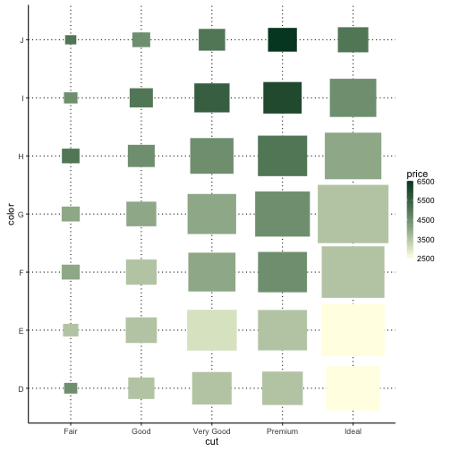

<!-- README.md is generated from README.Rmd. Please edit that file -->


# GGPlot2 version of "I'm Feeling Lucky!" [](https://cran.r-project.org/package=plotluck) [](https://cran.r-project.org/package=plotluck)

## Purpose

For exploratory data analysis in R, let users focus on *what* to plot, not *how*.

## Installation

To install the latest development branch:

```
install.packages('devtools')
library(devtools)
devtools::install_github("stefan-schroedl/plotluck")
```

## Motivation

Imagine you have given a new R data frame, and would like to get an overview of the distributions, or see how each column interacts with a specific target column. Typically, you would have to go through each column, and create a 1D or 2D plot depending on its type (e.g., a scatter plot for 2 numerical variables, or a box plot for one factor and one numeric variable). After looking at it, you might realize that outliers make it hard to see most of the data, so you plot it again with a logarithmic axis transform. Or, in the case of a box plot, if you have many factor levels, you might want to sort them first by the y-value.

`Plotluck` is a tool for exploratory data visualization in R that automates such steps. It creates complete graphics based on `ggplot`; the only things that have to be specified are the data frame, a formula, and optionally a weight column.

## Example


```r
library(plotluck)
data(diamonds, package='ggplot2')
plotluck(diamonds, price~cut+color)
```



## Features

* Automatic determination of the type of plot, based on the data types of the columns. Supports scatter, box, violin, bar, density, hex and spine plot, and heat maps.
* Overlays of smoothing curves and median lines.
* Automatic reordering of factor levels according to dependent variable.
* Automatic application of axis scaling, when appropriate (logarithmic or log-modulus).
* Correct handling and visualization of instance weights.
* Support for missing values in factors. 
* If the data set is too large to plot, sampling is applied.
* You can also create a grid of plots:
  * Distribution of each column in a data frame;
  * One target column against all others, ordering plots by degree of dependency (conditional entropy);
  * All pairs of columns. 

## What `plotluck` is _not_ built for

`Plotluck` is designed for generic out-of-the-box plotting, and not suitable to produce more specialized types of plots that arise in specific application domains (e.g., association, stem-and-leaf, star plots, geo maps, etc). It is restricted to at most three variables. Parallel plots with variables on different scales (such as time series of multiple related signals) are not supported.

## Learn More 

You can find more examples under `tests/testthat/test_plotluck.R.`

More background is given in the [vignette](http://htmlpreview.github.io/?https://github.com/stefan-schroedl/plotluck/blob/master/inst/doc/plotluck.html).
